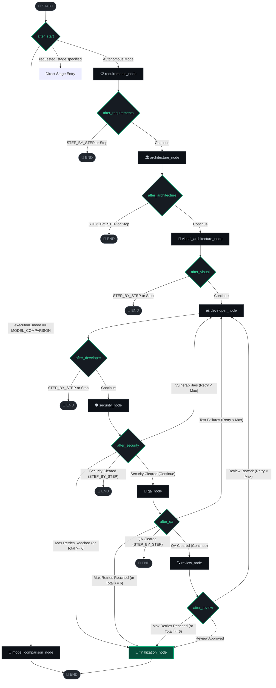
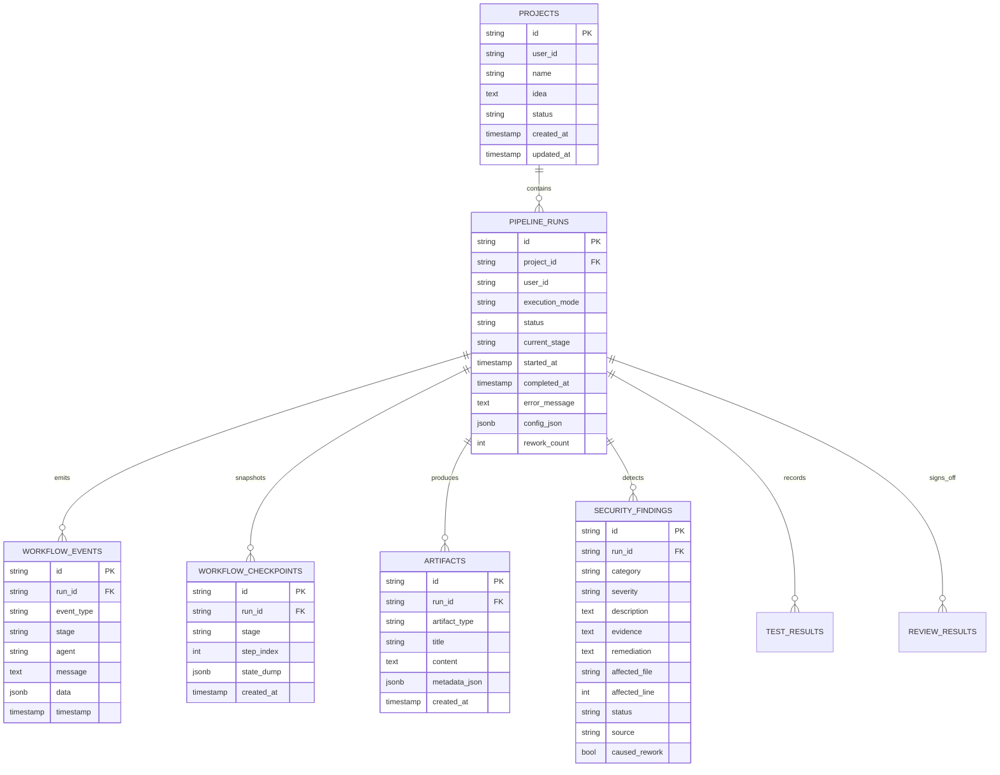

# ⚡ SDLC Nexus: Autonomous Multi-Agent Software Engineering Operating System

<div align="center">


<p align="center">
  <b>A production-grade, state-of-the-art autonomous multi-agent software engineering operating system.</b><br/>
  Orchestrates collaborative specialized AI agents to translate natural language ideas into production-ready software with continuous security AST scans, sandboxed Pytest execution, human-in-the-loop manual intervention, interactive terminal logs, and resilient Supabase PostgreSQL persistence.
</p>

</div>

---

## 📑 Table of Contents

- [🌟 Architectural Vision & Highlights](#-architectural-vision--highlights)
- [🤖 The Autonomous Agent Collective & Model Matrix](#-the-autonomous-agent-collective--model-matrix)
- [🔄 LangGraph Multi-Agent Orchestration Architecture](#-langgraph-multi-agent-orchestration-architecture)
  - [Exact LangGraph StateGraph Flow](#exact-langgraph-stategraph-flow)
  - [LangGraph ProjectState Contract](#langgraph-projectstate-contract)
  - [Dynamic Branching & Routing Logic](#dynamic-branching--routing-logic)
  - [Automated Rework Loops & Telemetry](#automated-rework-loops--telemetry)
- [📁 Project Architecture & Directory Layout](#-project-architecture--directory-layout)
- [🛡️ Hybrid Security & Vulnerability Center (Central + Project-Wise)](#️-hybrid-security--vulnerability-center-central--project-wise)
  - [Central Workspace Mode ("All Projects")](#central-workspace-mode-all-projects)
  - [Project-Scoped & Run-Scoped Audit Drilldown](#project-scoped--run-scoped-audit-drilldown)
  - [Deterministic AST Sinks & CWE Classification](#deterministic-ast-sinks--cwe-classification)
- [🧪 QA Testing & Interactive Terminal Execution Runner](#-qa-testing--interactive-terminal-execution-runner)
- [🛑 Human-In-The-Loop (HITL) Manual Intervention](#-human-in-the-loop-hitl-manual-intervention)
- [📦 Artifact Explorer & Project Deliverables](#-artifact-explorer--project-deliverables)
- [🗄️ Database Schema & Persistence Architecture (Supabase PostgreSQL)](#️-database-schema--persistence-architecture-supabase-postgresql)
  - [Entity Relationship Diagram](#entity-relationship-diagram)
  - [Sub-Millisecond Composite Indexing](#sub-millisecond-composite-indexing)
  - [PostgreSQL LangGraph Checkpointing](#postgresql-langgraph-checkpointing)
- [🧠 Model Router, Context Pruning & Resilience](#-model-router-context-pruning--resilience)
- [🔬 Model Lab & Benchmarking Suite](#-model-lab--benchmarking-suite)
- [⚙️ Environment Configuration Reference](#️-environment-configuration-reference)
- [🚀 Quick Start Guide](#-quick-start-guide)
  - [Prerequisites](#prerequisites)
  - [Backend Setup](#backend-setup)
  - [Frontend Setup](#frontend-setup)
- [📡 Complete API Reference](#-complete-api-reference)
- [🧪 Automated Test Suites](#-automated-test-suites)
- [📚 Deep-Dive Technical Documentation](#-deep-dive-technical-documentation)
- [📄 License & Authors](#-license--authors)

---

## 🌟 Architectural Vision & Highlights

SDLC Nexus replaces disjointed, single-prompt AI code generation with an **autonomous software engineering organization** modeled as a stateful, cyclic directed graph on **LangGraph**:

1. **True Supabase PostgreSQL Persistence**: All projects, pipeline runs, LangGraph checkpoints, chronological event logs, AST security findings, test outputs, and review sign-offs persist directly in Supabase PostgreSQL with pooled connections and composite indexing.
2. **Specialized Multi-Model Allocation**: Rather than relying on a single generic LLM, each agent is paired with an optimal model (Google Gemini 3.8-Flash with thinking levels, Gemini 3.5-Flash-Lite, Gemini 3.1-Flash-Lite, Groq GPT-OSS 120B, and Groq GPT-OSS 20B) with automatic multi-tier fallback chains.
3. **Deterministic & Semantic Guardrails**: Code generated by Developer Agent is verified through deterministic AST pattern matchers (SQL injection, XSS sinks, OS command injection, hardcoded secrets) and sandboxed Pytest runners before reaching senior code review.
4. **Automated Rework Loops with Telemetry**: When security vulnerabilities or test failures are detected, the workflow automatically generates structured telemetry messages (`SECURITY_FEEDBACK`, `QA_FEEDBACK`, `REVIEW_FEEDBACK`) and routes back to Developer Agent for automated refactoring.
5. **Human-In-The-Loop (HITL) Intervention**: When retry limits are reached, the workflow halts safely on `MANUAL_INTERVENTION_REQUIRED`. Engineers can provide custom steering prompts, directly edit code files in an in-browser editor, or override gates with instant optimistic UI feedback.
6. **Real-Time Token & State Streaming**: Server-Sent Events (SSE) pipe live agent reasoning tokens, status transitions, and inter-agent communications directly into an interactive React 19 visual canvas.
7. **Zero Mock Data Guarantee**: Every metric, traceback, sink, and deliverable is fetched dynamically from live Supabase tables.

---

## 🤖 The Autonomous Agent Collective & Model Matrix

The platform integrates 8 specialized agents registered in `backend/agents/__init__.py`. Each agent utilizes a tailored model and multi-stage fallback chain defined in `backend/llm/config.py`:

| Agent Identity | Node Key | Role & Persona | Primary Model Slot | Fallback Model Chain | Primary Output Contract |
| :--- | :--- | :--- | :--- | :--- | :--- |
| **📋 Requirements Analyst** | `requirements_node` | Senior Business Analyst / PM | `gemini-3.5-flash-lite` | 1. `gemini-3.1-flash-lite`<br/>2. `openai/gpt-oss-20b` (Groq) | Product Requirements Document (PRD), numbered user stories (`US-1..N`), acceptance criteria, and risks. |
| **🏛️ System Architect** | `architecture_node` | Principal System Architect | `gemini-3.8-flash`<br/>*(thinking_level: low)* | 1. `gemini-3.5-flash-lite`<br/>2. `openai/gpt-oss-20b` (Groq) | System architecture spec, frontend/backend stacks, database schemas, modular boundaries, and REST API contracts. |
| **🎨 Visual Architect** | `visual_architecture_node` | Technical Systems Illustrator | `gemini-3.1-flash-lite` | 1. `gemini-3.5-flash-lite`<br/>2. `openai/gpt-oss-20b` (Groq) | Syntactically verified Mermaid.js diagrams (C4 system flowchart, sequence diagrams, database ER models). |
| **💻 Developer Agent** | `developer_node` | Senior Full-Stack Engineer | `openai/gpt-oss-120b`<br/>*(Groq)* | 1. `gemini-3.5-flash-lite`<br/>2. `openai/gpt-oss-20b` (Groq) | Modular source codebase, dependency manifests, directory structure, and targeted rework modifications. |
| **🛡️ Security Lead** | `security_node` | Application Security Lead | `openai/gpt-oss-20b`<br/>*(Groq)* | 1. `gemini-3.5-flash-lite` | Dual-layer security audit: Python AST vulnerability sink detection + threat assessment with CWE classification. |
| **🧪 QA Engineer** | `qa_node` | Quality Assurance Engineer | `openai/gpt-oss-120b`<br/>*(Groq)* | 1. `gemini-3.5-flash-lite`<br/>2. `openai/gpt-oss-20b` (Groq) | Synthesized Pytest test suites, sandboxed test execution, traceback capture, and branch coverage analysis. |
| **🔍 Review Architect** | `review_node` | Staff Review Architect | `gemini-3.5-flash-lite` | 1. `gemini-3.1-flash-lite`<br/>2. `openai/gpt-oss-20b` (Groq) | Architectural consistency audit, separation of concerns review, and formal gate sign-off (`PASS` / `FAIL`). |
| **🔬 Multi-Model Benchmark** | `model_comparison_node` | Comparative Evaluation Agent | Multi-Model Dynamic | All configured models | Latency (ms), token volume, throughput, and code structure heuristic benchmarking. |

---

## 🔄 LangGraph Multi-Agent Orchestration Architecture

The orchestration engine is compiled as a `StateGraph(ProjectState)` in `backend/orchestration/graph.py` with state-preserving conditional routing in `backend/orchestration/routing.py`:

### Exact LangGraph StateGraph Flow



### LangGraph ProjectState Contract

State is typed and managed via `ProjectState` (`backend/orchestration/state.py`):

```python
class RetryCounts(TypedDict, total=False):
    security: int
    qa: int
    review: int

class ProjectState(TypedDict, total=False):
    project_id: str
    run_id: str
    user_id: str
    user_idea: str
    execution_mode: str  # "FULL_AUTONOMOUS" | "STEP_BY_STEP" | "MODEL_COMPARISON"
    current_stage: str
    current_agent: str
    demo_mode: bool
    stop_requested: bool
    developer_mode: str  # "INITIAL_IMPLEMENTATION" | "SECURITY_REWORK" | "QA_REWORK" | "REVIEW_REWORK"
    requested_stage: Optional[str]
    comparison_models: list[str]
    benchmark_prompt: Optional[str]
    primary_model: Optional[str]
    security_max_retries: int  # default: 2
    qa_max_retries: int        # default: 2
    review_max_retries: int    # default: 2
    
    # Generated Deliverable Payloads
    requirements: Optional[dict[str, Any]]
    architecture: Optional[dict[str, Any]]
    visual_architecture: Optional[dict[str, Any]]
    code: Optional[dict[str, Any]]
    security_report: Optional[dict[str, Any]]
    test_report: Optional[dict[str, Any]]
    review_report: Optional[dict[str, Any]]
    model_comparison: Optional[dict[str, Any]]
    
    # State Reducers & Telemetry
    messages: Annotated[list[dict[str, Any]], append_list]
    workflow_events: Annotated[list[dict[str, Any]], append_list]
    retry_counts: RetryCounts
    security_status: str  # "PENDING" | "PASS" | "REWORK" | "FAIL"
    testing_status: str   # "PENDING" | "PASS" | "FAIL"
    review_status: str    # "PENDING" | "PASS" | "FAIL"
    final_status: str     # "PENDING" | "COMPLETED" | "MANUAL_INTERVENTION_REQUIRED"
    errors: Annotated[list[dict[str, Any]], append_list]
    artifact_ids: Annotated[list[str], append_list]
    timestamps: dict[str, str]
    last_decision: Optional[str]
```

### Dynamic Branching & Routing Logic

1. **`after_start`**: Evaluates when invoking or resuming a run. If `execution_mode == "MODEL_COMPARISON"`, branches directly to `model_comparison_node`. If a `requested_stage` is provided (e.g., following manual intervention or step execution), routes straight to that stage. Otherwise, inspects existing artifacts in state to resume from the exact interrupted node.
2. **`after_requirements` / `after_architecture` / `after_visual` / `after_developer`**: Checks if `stop_requested` is true or if `execution_mode == "STEP_BY_STEP"`. If so, cleanly branches to `__end__`; otherwise, advances sequentially.
3. **`after_security`**:
   - If findings are blocking (`blocking == True` or `overall_status == "FAIL"`):
     - If `retry_counts["security"] < security_max_retries` and `total_reworks < 6`: routes to `developer_node` with `developer_mode="SECURITY_REWORK"`.
     - If retry threshold is reached: sets `final_status="MANUAL_INTERVENTION_REQUIRED"` and routes to `finalization_node`.
   - If security checks pass: advances to `qa_node` (or `__end__` if `STEP_BY_STEP`).
4. **`after_qa`**:
   - If test failures occur (`overall_status == "FAIL"` or `failed > 0`):
     - If `retry_counts["qa"] < qa_max_retries` and `total_reworks < 6`: routes to `developer_node` with `developer_mode="QA_REWORK"`.
     - If retry threshold is reached: sets `final_status="MANUAL_INTERVENTION_REQUIRED"` and routes to `finalization_node`.
   - If tests pass: advances to `review_node` (or `__end__` if `STEP_BY_STEP`).
5. **`after_review`**:
   - If review requires rework: routes to `developer_node` if under retry threshold, otherwise to `finalization_node`.
   - If approved: routes to `finalization_node` to complete the run.

---

## 📁 Project Architecture & Directory Layout

```
SDLC-AUTOMATION-WITH-AGENTS/
├── backend/
│   ├── agents/                     # 8 Specialized Autonomous Agents
│   │   ├── requirements_agent.py   # PRD generation & user story decomposition
│   │   ├── architecture_agent.py   # Tech stack, DB schema & API contracts
│   │   ├── visual_architecture_agent.py # Renderable Mermaid.js diagrams
│   │   ├── developer_agent.py      # Modular codebase synthesis & targeted refactoring
│   │   ├── security_agent.py       # AST pattern scanner & threat scoring
│   │   ├── qa_agent.py             # Pytest suite synthesis & subprocess runner
│   │   ├── review_agent.py         # Architectural & security sign-off auditor
│   │   └── multi_model_agent.py    # Side-by-side model comparison agent
│   ├── api/                        # Flask Blueprints & REST Endpoints
│   │   ├── projects.py             # Project CRUD & run initiation
│   │   ├── runs.py                 # Run status, HITL intervention & lifecycle
│   │   ├── security.py             # Central & run-scoped security findings
│   │   ├── qa.py                   # Pytest execution telemetry & test outputs
│   │   ├── review.py               # Review sign-off details
│   │   ├── artifacts.py            # Artifact bundle retrieval & exports
│   │   ├── models.py               # Model Lab benchmark endpoint
│   │   └── sse.py                  # Server-Sent Events live streaming
│   ├── config/                     # Settings parsing (Pydantic BaseSettings)
│   │   └── settings.py             # Unified environment & model configuration
│   ├── llm/                        # Multi-Provider Inference Layer
│   │   ├── config.py               # Central agent-to-model configuration & fallback chains
│   │   ├── router.py               # Dynamic ModelRouter with error categorization
│   │   ├── context.py              # Token sliding windows & trajectory pruning
│   │   ├── gemini_client.py        # Google GenAI client with RPD quota detection
│   │   ├── groq_client.py          # Groq Cloud client for GPT-OSS models
│   │   └── providers.py            # Provider adapter factories
│   ├── orchestration/              # LangGraph Execution Engine
│   │   ├── graph.py                # StateGraph assembly & checkpointer binding
│   │   ├── nodes.py                # Agent execution nodes & message dispatchers
│   │   ├── routing.py              # Conditional edge routing functions
│   │   ├── state.py                # Typed ProjectState schema & reducers
│   │   ├── runner.py               # Background thread execution runner
│   │   └── checkpointing.py        # Supabase PostgreSQL LangGraph checkpointer
│   ├── persistence/                # Database Access Layer
│   │   ├── database.py             # SQLAlchemy 2.0 engine & connection pool
│   │   └── repositories.py         # Sub-millisecond composite-indexed repository queries
│   ├── tools/                      # Deterministic Agent Tooling
│   │   ├── security_scanner.py     # Python AST vulnerability sink matcher
│   │   ├── test_execution.py       # Isolated Pytest subprocess sandbox
│   │   ├── mermaid_validator.py    # Syntax validator for live Mermaid diagrams
│   │   └── file_tools.py           # Codebase disk & zip packaging utilities
│   └── tests/                      # Automated Pytest Test Suite
├── frontend/                       # React 19 Single Page Application
│   ├── src/
│   │   ├── components/             # Reusable UI Components
│   │   │   ├── agents/             # Agent inspector & status cards
│   │   │   ├── artifacts/          # Mermaid viewer & syntax code viewer
│   │   │   ├── workflow/           # Visual canvas, stage nodes & communication stream
│   │   │   └── layout/             # Top navbar & sidebar navigation
│   │   ├── pages/                  # Top-Level Route Views
│   │   │   ├── Dashboard.tsx       # System health, recent runs & quick launch
│   │   │   ├── Projects.tsx        # Project catalog with status filters
│   │   │   ├── NewProject.tsx      # Project wizard with prompt presets
│   │   │   ├── LiveRun.tsx         # Real-time visual canvas & HITL intervention modal
│   │   │   ├── SecurityCenter.tsx  # Central & project-wise vulnerability dashboard
│   │   │   ├── QACenter.tsx        # Pytest Terminal Console & test results
│   │   │   ├── Artifacts.tsx       # Complete deliverable viewer (PRD, Spec, Code, Tests)
│   │   │   ├── ReviewCenter.tsx    # Architectural consistency & sign-off
│   │   │   └── ModelLab.tsx        # Multi-LLM latency & code quality benchmark
│   │   └── services/               # API clients & SSE event source handling
└── docs/                           # Extended Technical Specifications
```

---

## 🛡️ Hybrid Security & Vulnerability Center (Central + Project-Wise)

Accessible at `/security`, the Security & Vulnerability Center acts as both an enterprise security posture overview and a project-specific audit tool:

### Central Workspace Mode ("All Projects")
- **Cross-Project Posture**: Aggregates live security audit telemetry across every project stored in Supabase PostgreSQL.
- **Enterprise Metrics**: Total Projects Monitored, Scans Executed, Critical/High/Medium Findings, and Automated Remediations.
- **Monitored Projects Health Table**: Displays status badges (`PASS` / `WARNING` / `FAIL`), scan volume, breakdown counts, and last audit dates with an instant **Inspect** action.
- **Discovered AST Sinks**: Cross-project vulnerability sink feed tagged with project name, severity, category, and code location.

### Project-Scoped & Run-Scoped Audit Drilldown
- **Targeted Inspection**: Filter by any specific project (e.g. *Nexus Secure Food Delivery*, *advanced-calculator*) and specific pipeline run.
- **File & Line Precision**: Displays exact affected files, line numbers (`file:line`), and code snippets.
- **Deep-Linking**: Direct links into the **Artifact Explorer** for the relevant run.
- **Zero Mock Data**: 100% powered by real records in the Supabase `security_findings` table.

### Deterministic AST Sinks & CWE Classification

The `security_scanner.py` tool uses Python's `ast` library to identify unsafe patterns deterministically:

| CWE ID | Vulnerability Class | AST Detection Signature | Automated Remediation |
| :--- | :--- | :--- | :--- |
| **CWE-89** | SQL Injection | `cursor.execute(f"...{var}...")` or `%` string format | Converted to parameterized queries (`execute("... WHERE id = %s", (var,))`) |
| **CWE-79** | Cross-Site Scripting (XSS) | `render_template_string(f"...{user_input}...")` | Enforce auto-escaping Jinja2 templates or sanitization with `bleach` |
| **CWE-78** | OS Command Injection | `subprocess.Popen(..., shell=True)` with user variables | Set `shell=False` and pass arguments as structured lists |
| **CWE-798** | Hardcoded Secrets | Regex matches for API keys, bearer tokens, passwords | Move secrets to environment variables via `os.environ.get()` |

---

## 🧪 QA Testing & Interactive Terminal Execution Runner

The **QA Center** (`/qa`) and Artifact Explorer Test Suites tab feature a developer-first terminal interface:

- **Pytest Terminal Console (`pytest --tb=short runner`)**:
  - Dark terminal styling with macOS/Linux control dots.
  - ANSI syntax highlighting: emerald for `PASSED`, rose/red for `FAILED` and `ERROR`, amber for warnings.
  - One-click **Copy Log** button for instant debugging sharing.
  - Preserved line breaks and short tracebacks for rapid inspection.
- **Structured Failure Analysis**: Breaks down Pytest exceptions into comparison cards contrasting **Expected** vs. **Actual** outcomes with collapsible stack traces.
- **Generated Test Inspection**: Complete code viewer for auto-generated test suites (`tests/test_api.py`, etc.) with syntax highlighting.
- **Subprocess Sandbox**: Runs tests inside a dedicated temporary environment with execution timeouts to prevent hang-ups.

---

## 🛑 Human-In-The-Loop (HITL) Manual Intervention

When automated rework cannot resolve an issue within retry bounds (`rework_count >= max_retries` or total reworks >= 6), SDLC Nexus routes to `finalization_node`, marks `final_status="MANUAL_INTERVENTION_REQUIRED"`, and pauses for engineer input:

```
[Agent Rework Limit Exceeded] ──► [Pipeline Enters MANUAL_INTERVENTION_REQUIRED]
                                                   │
         ┌─────────────────────────────────────────┴─────────────────────────────────────────┐
         ▼                                         ▼                                         ▼
[Gate Override (action=OVERRIDE)]     [Guided Rework (action=REWORK)]              [Complete (action=COMPLETE)]
Bypasses gate to target stage         Sends guidance prompt to Developer           Marks run approved & completed
```

1. **Gate Override (`action="OVERRIDE"`)**: Resets stage retry count, marks gate status as `PASS`, and advances to the requested stage (e.g., bypass QA to proceed directly to `REVIEW`).
2. **Guided Rework (`action="REWORK"`)**: Injects human guidance (e.g., *"Use psycopg2 parameterized queries to fix line 24"*) into `developer_node` and relaunches development with `developer_mode="QA_REWORK"`.
3. **In-Browser Code File Editor**: Select any generated file, view code, make inline edits, and save changes before resuming.
4. **Approve & Complete (`action="COMPLETE"`)**: Marks the run as officially approved and finalized.
5. **Optimistic UI Updates**: Immediate feedback in the browser prevents buttons from sticking or freezing while state commits.

---

## 📦 Artifact Explorer & Project Deliverables

Accessible via `/artifacts?run_id=<run_id>`, the Artifact Explorer packages all pipeline outputs into a unified workspace:

1. **Requirements PRD**: Formatted project summary, functional/non-functional requirements, user stories (`US-1..N`) with role, goal, and benefit breakdown, acceptance criteria, and risks.
2. **Architecture Spec**: Architecture style, frontend stack, backend stack, database selection, auth model, modules, and API contracts.
3. **Mermaid Diagrams**: Interactive visual architecture diagrams rendered dynamically via Mermaid.js (system flowcharts, sequence diagrams, ER models) with zoom and pan.
4. **Generated Codebase**: Interactive file tree with full-screen syntax-highlighted code viewer, dependency manifests, and quick copy actions.
5. **Security Report**: Audit breakdown by severity, CWE category, sink location, and automated remediation actions.
6. **Test Suites**: Pytest summary, execution duration, test coverage percentage, and interactive terminal logs.
7. **Review Sign-Off**: Senior engineering gate review, architectural consistency analysis, and formal approval status.
8. **Export Deliverables JSON**: One-click download of all pipeline artifacts packaged as structured JSON.

---

## 🗄️ Database Schema & Persistence Architecture (Supabase PostgreSQL)

SDLC Nexus is backed by **Supabase PostgreSQL** via SQLAlchemy 2.0 with connection pooling:

### Entity Relationship Diagram



### Sub-Millisecond Composite Indexing

To guarantee sub-millisecond query execution on dashboards with large event streams, the schema maintains composite indexes:
- `idx_projects_user_created` on `projects(user_id, created_at DESC)`
- `idx_runs_project_started` on `pipeline_runs(project_id, started_at DESC)`
- `idx_workflow_events_run_time` on `workflow_events(run_id, timestamp ASC)`
- `idx_workflow_checkpoints_run_created` on `workflow_checkpoints(run_id, created_at DESC)`
- `idx_artifacts_run_type` on `artifacts(run_id, artifact_type)`
- `idx_security_findings_run_sev` on `security_findings(run_id, severity)`

### PostgreSQL LangGraph Checkpointing

The custom `PostgresCheckpointSaver` (`backend/orchestration/checkpointing.py`) serializes the LangGraph memory state at each node transition directly into the `workflow_checkpoints` table. If the backend restarts or a run is paused for manual intervention, the pipeline resumes without data loss.

---

## 🧠 Model Router, Context Pruning & Resilience

SDLC Nexus features a resilient Model Router (`backend/llm/router.py`) that matches agent tasks to optimal models:

- **Primary Provider**: Google Gemini (`gemini-3.8-flash`, `gemini-3.5-flash-lite`, `gemini-3.1-flash-lite`).
- **Secondary Provider**: Groq Cloud (`openai/gpt-oss-120b`, `openai/gpt-oss-20b`, `groq/compound`).
- **Daily Quota (RPD) & Rate Limit Detection**: `classify_gemini_error()` intercepts free-tier 429 daily request quota exhaustions and initiates immediate failover without wasting retries.
- **Context Pruning & Sliding Windows**: Long agent message trajectories are pruned dynamically using token-aware sliding windows (`backend/llm/context.py`), preventing context overflow errors during extended rework loops.

---

## 🔬 Model Lab & Benchmarking Suite

Accessible via `/models`, the **Model Lab** provides a side-by-side benchmarking suite for multi-model evaluation:
- Run concurrent engineering prompts across Gemini (`gemini-3.8-flash`) and Groq (`openai/gpt-oss-120b`, `openai/gpt-oss-20b`, `groq/compound`, `groq/compound-mini`).
- Measure latency (milliseconds), token generation throughput, and response length.
- Evaluate structural engineering heuristic scores (JSON validity, schema compliance, code quality).

---

## ⚙️ Environment Configuration Reference

| Environment Variable | Required | Default Value | Description |
| :--- | :---: | :--- | :--- |
| `LLM_PROVIDER` | Yes | `gemini` | Primary inference provider (`gemini` or `groq`) |
| `ENABLE_LLM_FALLBACK` | No | `true` | Enable automatic failover to secondary provider on rate/quota limits |
| `GEMINI_API_KEY` | Yes* | - | Google AI Studio Gemini API Key |
| `GEMINI_MODEL` | No | `gemini-3.8-flash` | Default Gemini model |
| `GEMINI_FAST_MODEL` | No | `gemini-3.8-flash` | Gemini fast model |
| `GEMINI_THINKING_LEVEL` | No | `low` | Thinking level for Gemini reasoning tasks (`low`, `high`, `off`) |
| `GROQ_API_KEY` | Yes* | - | Groq Cloud API Key |
| `GROQ_MODEL` | No | `openai/gpt-oss-120b` | Default Groq primary model |
| `GROQ_FAST_MODEL` | No | `openai/gpt-oss-20b` | Groq fast model |
| `GROQ_FALLBACK_MODEL` | No | `openai/gpt-oss-20b` | Groq fallback model |
| `PRIMARY_MODEL` | No | `gemini-3.8-flash` | Model assigned to requirements and developer agents |
| `FAST_MODEL` | No | `gemini-3.8-flash` | Model assigned to speed-critical tasks |
| `REASONING_MODEL` | No | `gemini-3.8-flash` | Model assigned to architecture, security, and review |
| `COMPARISON_MODELS` | No | `gemini-3.8-flash,openai/gpt-oss-120b,openai/gpt-oss-20b,groq/compound,groq/compound-mini` | Models benchmarked in Model Lab |
| `DATABASE_URL` | Yes | - | Supabase PostgreSQL URI (port 6543 pooler recommended) |
| `DB_POOL_SIZE` | No | `10` | SQLAlchemy connection pool size |
| `DB_MAX_OVERFLOW` | No | `20` | SQLAlchemy max overflow connections |
| `DB_POOL_RECYCLE` | No | `1800` | Connection recycle period in seconds |
| `DB_CONNECT_TIMEOUT` | No | `10` | Connection timeout in seconds |
| `SECURITY_MAX_RETRIES` | No | `2` | Maximum rework cycles before security triggers HITL |
| `QA_MAX_RETRIES` | No | `2` | Maximum rework cycles before QA triggers HITL |
| `REVIEW_MAX_RETRIES` | No | `2` | Maximum rework cycles before Review triggers HITL |
| `CODE_EXECUTION_TIMEOUT_SECONDS` | No | `15` | Timeout for Pytest sandbox subprocess |
| `DEMO_MODE` | No | `false` | Enable mock agent data (disable for live AI inference) |
| `SECRET_KEY` | Yes | - | Secret key used for session cryptographic signatures |

*\* At least one LLM provider key (`GEMINI_API_KEY` or `GROQ_API_KEY`) is required.*

---

## 🚀 Quick Start Guide

### Prerequisites
- **Python 3.11+**
- **Node.js 18+** & **npm**
- **Supabase Account** (or any PostgreSQL instance)
- **API Keys**: Google Gemini API key and/or Groq API key

---

### Backend Setup

1. **Clone the repository**:
   ```bash
   git clone https://github.com/SAICHARAN1189/SDLC-AUTOMATION-WITH-AGENTS.git
   cd SDLC-AUTOMATION-WITH-AGENTS
   ```

2. **Create and activate a Python virtual environment**:
   ```bash
   # Windows (PowerShell)
   python -m venv venv
   .\venv\Scripts\Activate.ps1

   # Linux / macOS
   python3 -m venv venv
   source venv/bin/activate
   ```

3. **Install dependencies**:
   ```bash
   pip install -r backend/requirements.txt
   ```

4. **Configure `.env`**:
   Copy `.env.example` to `.env` in both project root and `backend/`:
   ```bash
   cp .env.example .env
   cp .env.example backend/.env
   ```
   Add your `DATABASE_URL`, `GEMINI_API_KEY`, and `GROQ_API_KEY`.

5. **Start the Flask API server**:
   ```bash
   cd backend
   python app.py
   ```
   The backend will initialize database tables in Supabase and start listening on `http://localhost:8000`.

---

### Frontend Setup

1. **Navigate to the frontend directory**:
   ```bash
   cd frontend
   npm install
   ```

2. **Start the Vite development server**:
   ```bash
   npm run dev
   ```
   Open your browser to `http://localhost:5173`.

---

## 📡 Complete API Reference

| HTTP Method | Route | Description |
| :--- | :--- | :--- |
| `GET` | `/api/health` | Health status, database ping, and active LLM provider info |
| `GET` | `/api/projects` | List all projects belonging to the user |
| `POST` | `/api/projects` | Create a new project with a software idea prompt |
| `GET` | `/api/projects/<id>` | Fetch project details along with its pipeline execution history |
| `PATCH` | `/api/projects/<id>` | Update project name or idea |
| `DELETE` | `/api/projects/<id>` | Delete project and cascade-delete all runs and artifacts |
| `POST` | `/api/projects/<id>/runs` | Launch an autonomous or step-by-step SDLC pipeline run |
| `GET` | `/api/runs/<id>` | Get real-time status, current stage, and state checkpoint for a run |
| `POST` | `/api/runs/<id>/stop` | Terminate an active pipeline run safely |
| `GET` | `/api/runs/<id>/stream` | Server-Sent Events (SSE) live stream for agent tokens and events |
| `POST` | `/api/runs/<id>/intervene` | Submit human-in-the-loop manual intervention (resume/override/rework/edit) |
| `GET` | `/api/runs/<id>/events` | Fetch complete chronological event log for a run |
| `GET` | `/api/runs/<id>/artifacts` | Fetch all generated deliverables (PRD, Architecture, Code, etc.) |
| `GET` | `/api/security` | **Central Security Overview** across all projects (supports `?project_id=`) |
| `GET` | `/api/security/<run_id>` | Detailed security findings and CWE classifications for a specific run |
| `GET` | `/api/tests/<run_id>` | Full QA test results, execution status, and pytest terminal outputs |
| `GET` | `/api/review/<run_id>` | Senior code review sign-off and architectural consistency assessment |
| `POST` | `/api/models/compare` | Run side-by-side model latency and reasoning benchmark in Model Lab |

---

## 🧪 Automated Test Suites

SDLC Nexus maintains an extensive test suite verifying database persistence, agent contracts, and model routing:

```bash
# Run all tests (from repository root)
python -m pytest -v backend/tests

# Test Supabase PostgreSQL persistence specifically
python -m pytest -v backend/tests/test_supabase_persistence.py

# Test Model Router and fallback resilience
python -m pytest -v backend/tests/test_model_router.py
python -m pytest -v backend/tests/test_provider_resilience.py

# Test Developer & QA Agent execution contracts
python -m pytest -v backend/tests/test_developer_qa_contract.py

# Frontend TypeScript validation
cd frontend && npx tsc --noEmit
```

---

## 📚 Deep-Dive Technical Documentation

For in-depth architectural specifications and implementation guides, explore the `docs/` directory:

- [🏗️ System Architecture](docs/ARCHITECTURE.md) — Comprehensive architectural overview and component design.
- [🔄 LangGraph Workflow Specification](docs/LANGGRAPH_WORKFLOW.md) — Deep dive into state graphs, nodes, and conditional edges.
- [🤖 Agentic Behavior & Prompt Engineering](docs/AGENTIC_BEHAVIOR.md) — Personas, system prompts, and tool contracts.
- [💬 Inter-Agent Communication](docs/AGENT_COMMUNICATION.md) — Protocol for structured telemetry and rework messages.
- [🗄️ Database Architecture](docs/DATABASE.md) — Schema design, indexing strategy, and connection pooling.
- [🛡️ Security Architecture](docs/SECURITY.md) — AST scanner rules, threat models, and sanitization gates.
- [⚡ Supabase Integration Guide](docs/SUPABASE.md) — Transaction pooler setup and checkpoint persistence.
- [📡 API Documentation](docs/API.md) — Endpoint contracts, schemas, and payload examples.
- [🚢 Deployment Guide](docs/DEPLOYMENT.md) — Production Docker and cloud deployment walkthrough.
- [🎮 Demonstration Guide](docs/DEMO_GUIDE.md) — Step-by-step demonstration script for live presentations.

---

## 📄 License & Authors

This project is licensed under the **MIT License** — see the [LICENSE](LICENSE) file for details.

<div align="center">
  <b>Engineered with precision by Saicharan & the SDLC Nexus Team</b>
</div>
